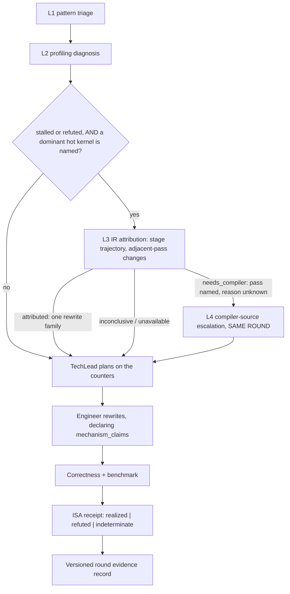

# The compiler-grounded evidence ladder

How this lane decides how deep to look, what each depth may claim, and why the deepest levels are
worth their cost. Four levels, and the two expensive ones only run when the cheap ones have localised
the problem and still cannot say what to change.

## The levels

**L1 — pattern triage.** Code structure and prior knowledge. Recorded as `L1_pattern`.

**L2 — profiling diagnosis.** `profile_engineer.md` classifies the bottleneck from the counters and
names the hot kernels. Recorded as `L2_profile`, which is the normal value for a round: profiling is
unconditional, so the ladder records it rather than gating it.

**L3 — IR attribution.** `ir_engineer.md` reconstructs the operator's stage-by-stage lowering
trajectory and attributes the plateau to an adjacent pass pair. Its output is a **pass** and a
**structure**: "`si-insert-waitcnts` added 14 sync ops at stage 93". Recorded as `L3_ir`.

**L4 — compiler-source escalation.** `compiler_engineer.md` recovers why that pass behaved that way.
Its output is a **precondition** a source edit must satisfy. Recorded as `L4_compiler_source`.

## What changed, and why

The lane previously had three rungs — `pattern | isa | compiler` — and the middle one read the AMDGCN
disassembly. Four consequences followed, and they compounded:

**L3 could not attribute to a pass.** Machine code is the end of the pipeline. It can show that a wide
load is absent; it cannot show which stage dropped it. L3's output was `vgpr=152, scratch=0,
global_load_bytes.max=4` — true numbers naming no pass.

**So L4 had no narrow question.** With only disassembly statistics in hand, the compiler role had to
reason about the entire backend. Its only way to make progress was to rebuild with different flags and
compare — which is another experiment, not an explanation.

**L4 had no knowledge tier.** It went straight from "the machine code looks like this" to reading
backend sources this image does not ship. The tier that should resolve most questions did not exist.

**L4 was unreachable anyway.** `evidenceLadder` could only request `compiler` from a round whose prior
depth was already `isa`. Reaching `isa` requires `noImprove >= 1`; if that round also fails to move,
`noImprove` becomes 2, and `MAX_NO_IMPROVE` defaults to 2, so the loop exits first. The only live path
to the deepest rung was `priorRefuted` — which **skipped L3 entirely**. The deepest level was reached
exclusively by the route that gave it nothing to work with.

## The fixes

**L3 reads a trajectory, not a disassembly.** `ir_capture.py` replays the build's own device compile
command with `-mllvm -print-changed=quiet` and splits the result into per-pass stages; `ir_signals.py`
navigates them and ranks adjacent-pass deltas. On the real `tall_bf16_gemm_kernel` this yields 96
stages across 63 distinct passes, and `find-changes` reports things like "`InlinerPass` added 2 loads"
and "`si-insert-waitcnts` added 14 sync ops" — the shape L4 can be handed.

**A refutation routes to L3, not past it.** "My edit did not reach the binary" is first of all a
question about which pass undid it.

**L4 is entered inside the round.** Immediately after L3 returns `needs_compiler` with
`suspected_passes` and one `compiler_question`. Waiting for the next round put the decision behind a
stop budget that ends the lane first.

**L4 consults knowledge first.** `perf_knowledge/compiler_grounding/` — a pass navigation map built
from the passes actually observed on this image, question templates, and measured backend invariants.
Tier 1 (optimization remarks) and Tier 2 (backend source) follow only if Tier 0 leaves the question
open.

**The record is versioned.** `evidence.model = geak.evidence-ladder/v2`, with `requested_stage` and
`reached_stage` in separate fields. A round banked before this existed reads as `legacy_machine_code`,
which satisfies no rung — a resumed lane must not inherit evidence nobody produced.

## Where ISA fits now

The paper's ladder has no "read the disassembly" level, but the disassembly has a job in this lane that
the paper does not cover, and it is a good one: **deciding whether a rewrite reached the binary at
all.** `isa_capture.py` archives the artifact that actually ran and deliberately does not recompile;
`isa_signals.py diff --claim` compares it against the parent and reports `realized | refuted |
indeterminate` against a mechanism the engineer declared *before* measurement.

That is verification, not diagnosis, and it stays in `verify_engineer.md` unchanged.

Inside L3 the ISA archive has exactly two uses. First, **provenance**: the trajectory comes from a
recompile, so `ir_capture.py` re-derives the object without the evidence flags and proves it matches
the measured one per kernel. Until that passes, the stages describe *a* program and not *the* program.
Second, **optional corroboration** after the pass is named. It may never be the source of the
diagnosis — `admissibleAttribution` refuses an `attributed` or `needs_compiler` return that carries no
`attributed_pass` and `stage_transition`, which is the schema-level half of a rule the role also states
in prose.

## Two credibility fixes to the ISA layer

**`unchanged_machine_code` now prefers code-object digests.** It was an opcode multiset plus the
register/LDS/scratch budget — blind to a change in operands, immediates or instruction order — and
`mechanism_verdict` converts `unchanged` into a hard `refuted` regardless of the per-claim checkers. So
the weak test could refute a candidate that did change the binary. `isa_capture.py` now records a
SHA-256 per code object and the diff uses it when both sides carry one, reporting which basis it used.
This can only move a verdict from "unchanged" to "changed", so it never newly refuses anything.

**A claim now names where it landed.** A claim holds if *any* shared kernel moved in the claimed
direction. That rule stays — requiring the hot kernel would reinstate the false negative recorded in
`learned_rules.md` ("Two ISA-evidence validity traps"), where a verified −4.72% patch came back refuted
because every pre-existing symbol was legitimately unchanged. What was missing is that the receipt did
not say *which* kernel satisfied it, so a mechanism landing on a cold sibling read exactly like one
landing on the measured route. `realized_in` and `realized_outside_target` say so. Reported, never
enforced.

## Operator switches

- `isa_evidence=off|observe|gate` — the verification receipt. `observe` is the default.
- `ir_diagnostics=on|off` — the L3/L4 trajectory. Defaults on. Separate because the costs differ: the
  ISA receipt reads the artifact that ran and cannot break a build, while the IR trajectory rebuilds a
  translation unit in a scratch tree to look at it.
- `compiler_source_dir=<path>` — an optional read-only AMDGPU checkout for L4 Tier 2. Empty by default
  and expected to stay empty on this image.

## What is pinned

`test_lane_gates.js` executes the ladder against fabricated histories: a refutation reaches L3 and not
L4; L4 is never requested at the top of a round; escalation requires a named hot kernel; a pre-v2
record reads as legacy; an attribution naming no pass is inadmissible; L4 needs both a pass list and a
question; `unavailable` is not `inconclusive`; and **L4 is reachable within the default stop budget**,
which is asserted by simulating the loop against `MAX_NO_IMPROVE` read out of the lane.

`test_js_suite.py` mutates each of those rules in `kernel_lane.js` and fails if the suite still passes.
`test_ir_capture.py` and `test_ir_signals.py` cover the capture and the readers with synthetic dumps
and an injected compiler, and `test_isa_signals.py` carries the two counter-examples above.
